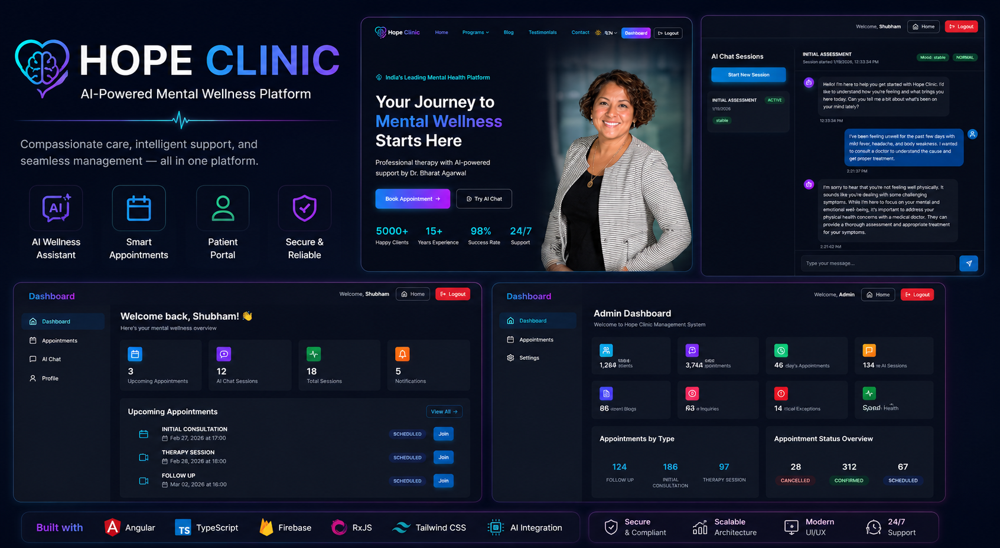
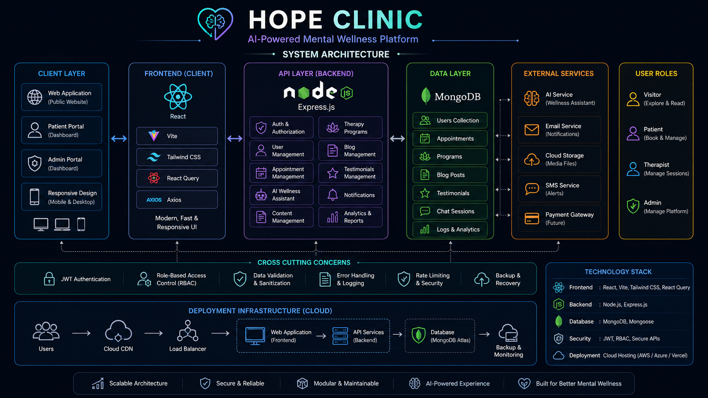
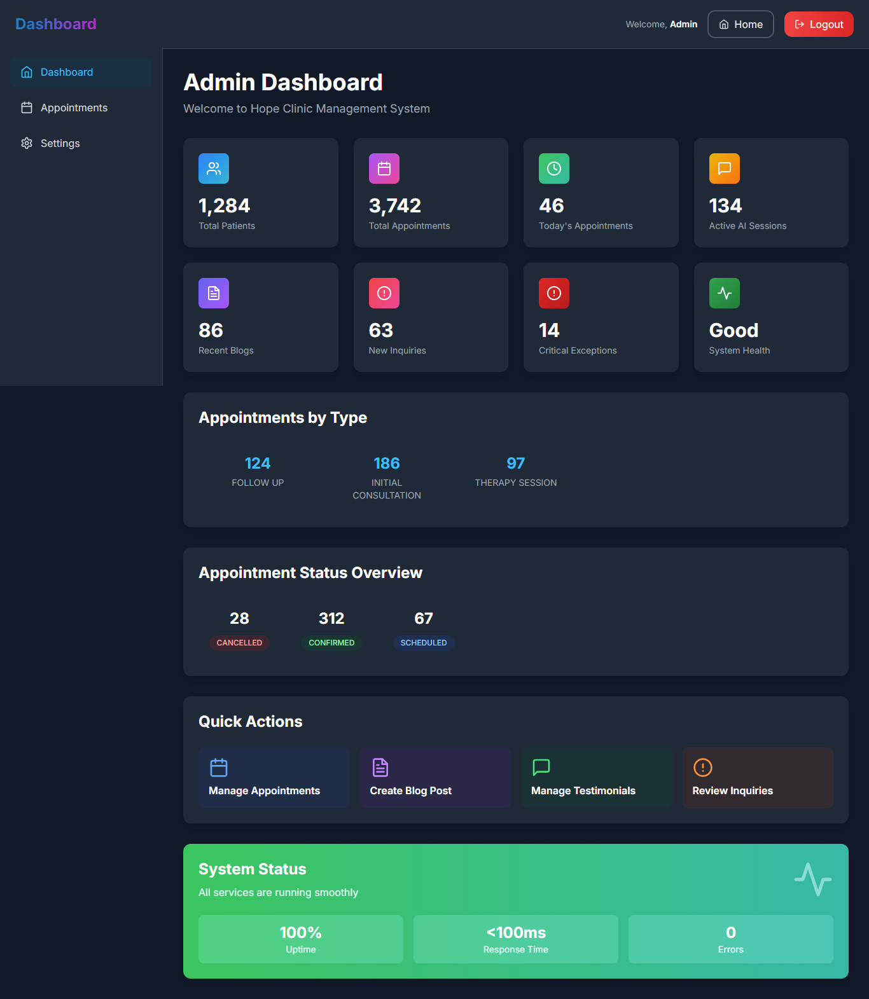
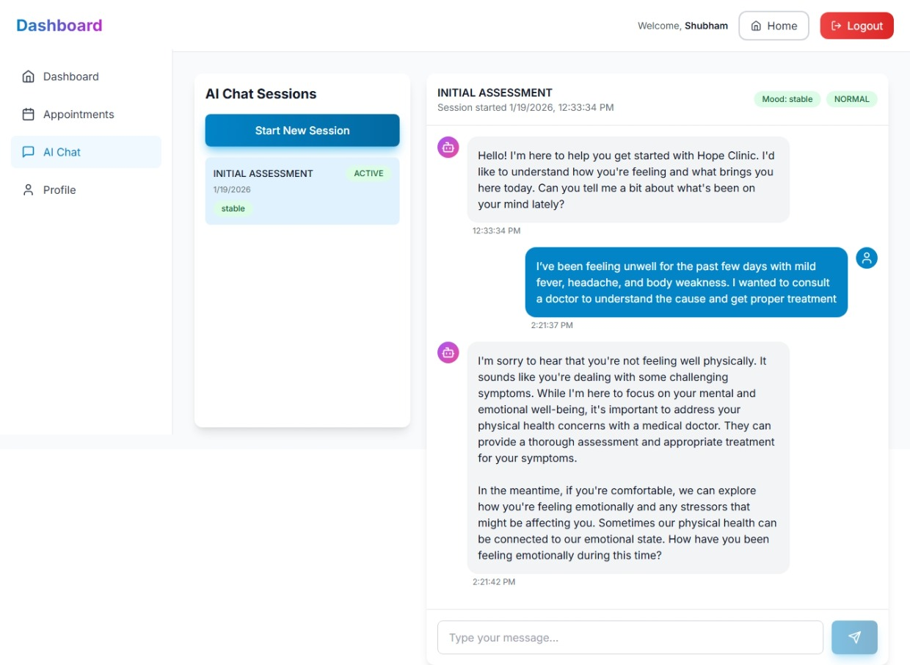
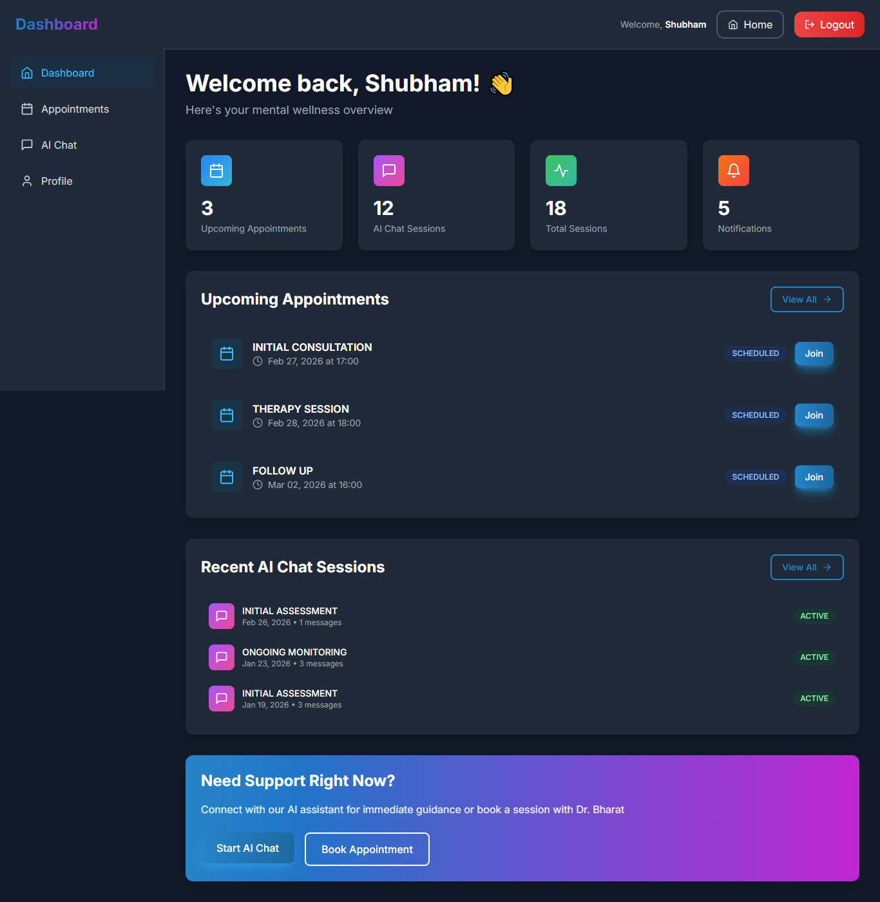
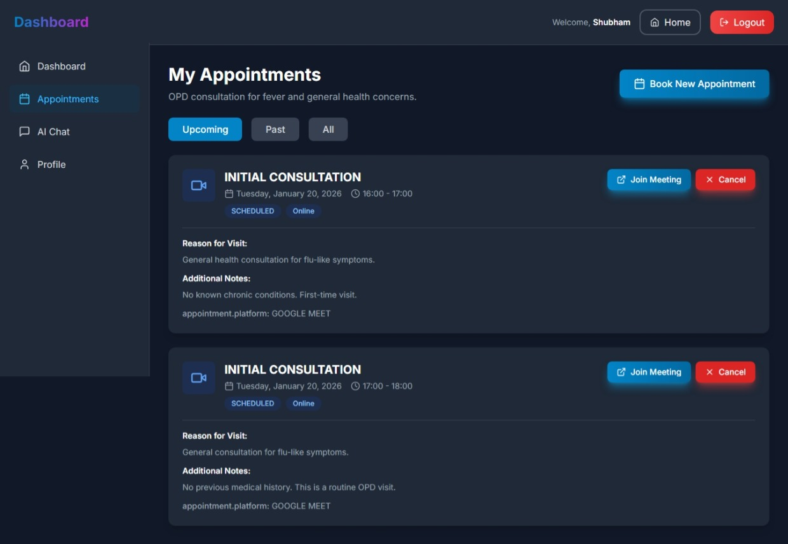
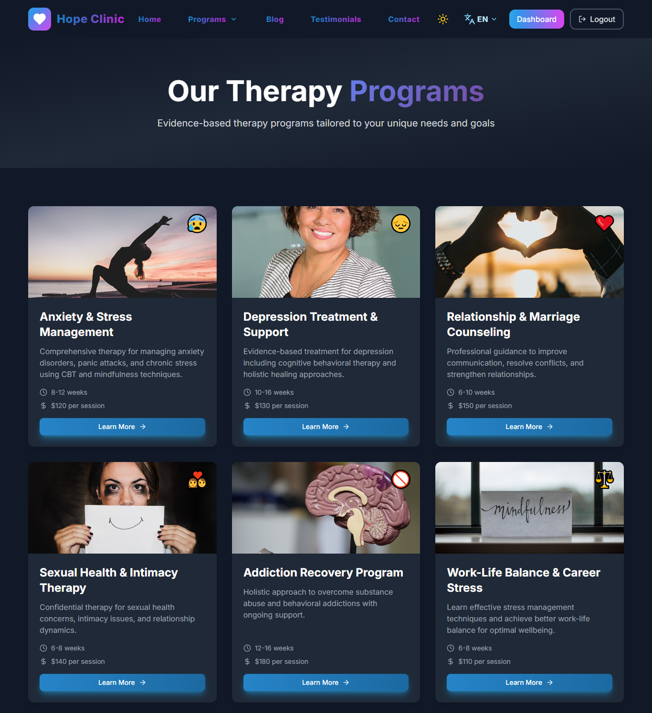
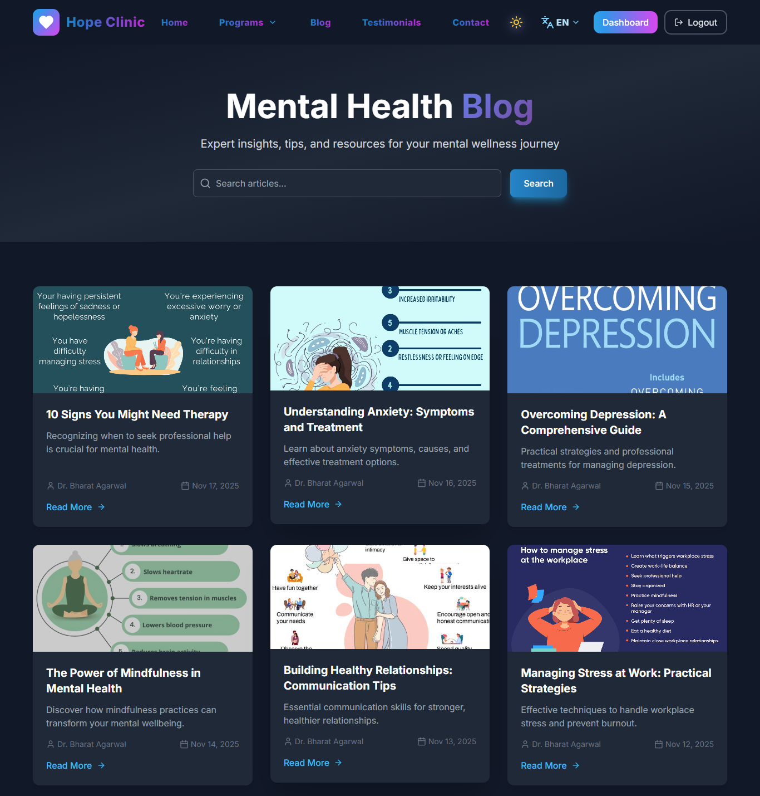
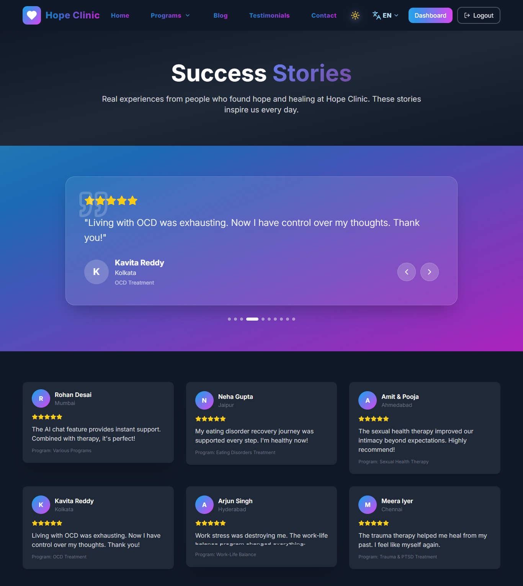
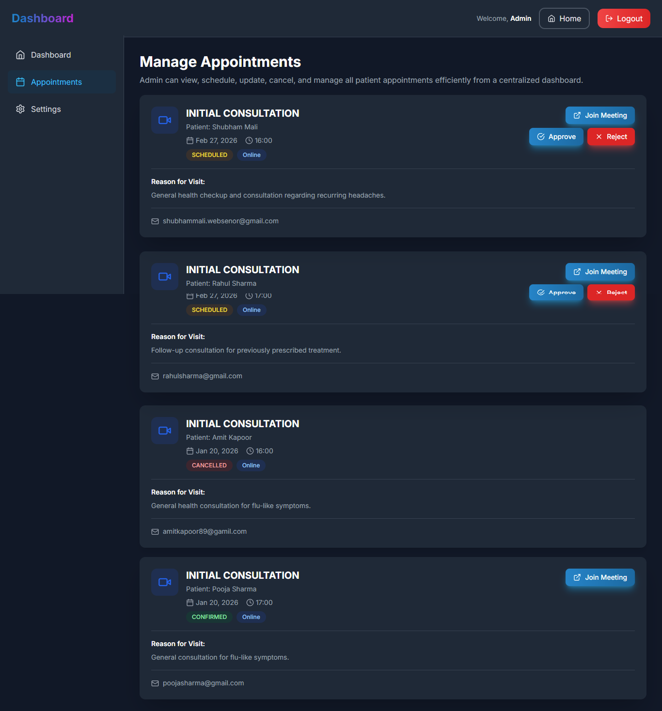

# 🏥 Hope Clinic — AI-Powered Mental Wellness Platform


An AI-powered mental wellness platform designed to streamline therapy programs, appointment scheduling, patient engagement, healthcare content management, and administrative operations through a unified digital healthcare ecosystem.

---

<p align="center">
  
</p>

---

## 🌐 Live Platform

https://hopeclinic.cloud

---

# Platform Vision

Hope Clinic is a modern digital mental wellness ecosystem engineered to improve patient engagement, simplify appointment management, provide AI-assisted wellness support, and enhance healthcare operations through an integrated platform.

The platform combines public healthcare experiences, therapy program discovery, patient management, AI-powered assistance, and operational dashboards into a single scalable solution.

---

# Platform Highlights

* AI-powered wellness assistant
* Online appointment booking
* Patient self-service portal
* Administrative operations dashboard
* Therapy program management
* Healthcare blog platform
* Testimonials & success stories
* Role-based access management
* Responsive user experience
* Dark & light theme support
* Multi-language support
* Secure authentication workflows

---

# Platform Capabilities

- Multi-step appointment workflows
- AI-assisted patient support
- Patient self-service portal
- Administrative operations dashboard
- Healthcare content publishing
- Therapy program management
- Secure authentication workflows
- Responsive web experience

---

# Business Problem

Mental wellness organizations often struggle with fragmented appointment systems, disconnected patient communication channels, manual operational processes, and limited digital engagement experiences.

Traditional healthcare platforms frequently lack intelligent patient support, centralized content management, and streamlined operational workflows.

---

# Business Outcomes

* Improved patient engagement
* Simplified appointment workflows
* Better healthcare accessibility
* Enhanced operational efficiency
* Centralized healthcare administration
* Improved digital wellness experiences

---

# Key Use Cases

* Mental wellness platforms
* Therapy management systems
* Healthcare appointment portals
* Patient engagement platforms
* AI-assisted healthcare solutions
* Digital wellness ecosystems
* Healthcare administration systems

---

# Solution

Hope Clinic centralizes patient engagement, therapy program management, appointment scheduling, AI-assisted support, and healthcare administration into one modern platform.

The system enables healthcare organizations to deliver better digital experiences while improving operational efficiency and patient accessibility.

---

# Core Modules

## 🌐 Public Experience

* Landing Platform
* Therapy Programs
* Mental Health Blog
* Testimonials & Success Stories
* Contact & Inquiry System

---

## 📅 Appointment Management

* Multi-Step Appointment Booking
* Appointment Scheduling
* Appointment Tracking
* Patient Consultation Workflows

---

## 🤖 AI Wellness Assistant

* AI Chat Sessions
* Patient Guidance
* Wellness Support
* Healthcare Information Assistance

---

## 👤 Patient Portal

* Patient Dashboard
* Appointment Management
* Personal Health Experience
* Profile Management

---

## ⚙️ Administrative Operations

* Executive Dashboard
* Appointment Administration
* Content Management
* Operational Monitoring
* Platform Analytics

---

# Patient Journey Workflow

```text
Visitor
   │
   ▼
Explore Therapy Programs
   │
   ▼
Read Healthcare Content
   │
   ▼
Book Appointment
   │
   ▼
AI Wellness Assistance
   │
   ▼
Patient Dashboard
   │
   ▼
Appointment Management
   │
   ▼
Healthcare Support
```

---

# Technology Stack

## Frontend

* React
* Vite
* Tailwind CSS
* React Query

### Backend

* Node.js
* Express.js

### Database

* MongoDB
* Mongoose

### Security

* JWT Authentication
* Role-Based Access Control

### Deployment

* Cloud Hosting
* Production Environment Configuration

---

# Architecture Highlights

* Full-stack healthcare architecture
* AI-assisted patient engagement
* Role-based healthcare workflows
* Appointment-centric platform design
* Modular service architecture
* Cloud-ready deployment model

---

# System Architecture

The platform follows a modular full-stack architecture designed to support patient engagement, appointment management, AI-assisted wellness support, healthcare content delivery, and administrative operations.

<p align="center">
  
</p>

### Architecture Overview

```text
Users
│
├── Public Visitors
├── Patients
├── Therapists
└── Administrators
        │
        ▼
Frontend Layer (React + Vite + Tailwind CSS)
        │
        ▼
Backend API Layer (Node.js + Express.js)
        │
        ├── Authentication & Authorization
        ├── Appointment Management
        ├── AI Wellness Assistant
        ├── Therapy Program Management
        ├── Blog Management
        ├── Testimonials Management
        ├── Notification Services
        └── Analytics & Reporting
        │
        ▼
Database Layer (MongoDB)
        │
        ├── Users
        ├── Appointments
        ├── Programs
        ├── Blog Posts
        ├── Testimonials
        └── Chat Sessions
        │
        ▼
External Services
        ├── AI Assistant
        ├── Email Notifications
        ├── Cloud Storage
        └── SMS Services
```

### Key Architectural Principles

- Modular and scalable application design
- Secure JWT-based authentication
- Role-based access control (RBAC)
- Separation of frontend, backend, and data layers
- Cloud-ready deployment architecture
- Responsive user experience across devices
- AI-assisted patient engagement workflows
- Maintainable and extensible codebase

---

# Platform Preview

Hope Clinic delivers a connected digital healthcare experience through
therapy programs, appointment management, AI-assisted support,
patient engagement, healthcare content, and administrative operations.

The platform is designed to improve accessibility, streamline workflows,
and provide a modern mental wellness experience for patients and healthcare teams.

---

# Platform Showcase

## 🏥 Healthcare Operations Dashboard

<p align="center">
  
</p>

Modern operational dashboard providing visibility into appointments, platform activity, patient engagement, and healthcare workflows.

---

## 🤖 AI Wellness Assistant

<p align="center">
  
</p>

AI-powered patient support experience designed to improve accessibility, engagement, and wellness guidance.

---

## 📅 Intelligent Appointment Booking

<p align="center">
  
</p>

Streamlined multi-step appointment workflow enabling patients to schedule consultations efficiently.

---

## 👤 Patient Dashboard

<p align="center">
  
</p>

Personalized patient dashboard providing appointment tracking, healthcare interactions, and wellness resources.

---

## 📋 Patient Appointment Management

<p align="center">
  
</p>

Centralized appointment management experience for patients and healthcare teams.

---

## 🎯 Therapy Programs

<p align="center">
  
</p>

Comprehensive wellness programs supporting mental health, counseling, recovery, and personal development.

---

## 📝 Mental Health Blog Platform

<p align="center">
  
</p>

Educational healthcare content designed to improve awareness, engagement, and patient outcomes.

---

## ⭐ Patient Success Stories

<p align="center">
  
</p>

Community-driven testimonials and real-world wellness success stories.

---

## 🏥 Administrative Appointment Operations

<p align="center">
  
</p>

Administrative workflows for managing appointments, operational efficiency, and healthcare coordination.

---

# Security Architecture

The platform includes:

* JWT Authentication
* Protected API Endpoints
* Role-Based Access Control
* Secure Session Management
* Protected Administrative Workflows

---

# Scalability Engineering

* Modular Architecture
* Scalable API Design
* Database Optimization
* Cloud Deployment Ready
* Responsive User Experience
* Maintainable Component Structure

---

# Deployment Infrastructure

* Cloud Hosted Platform
* Production Ready Configuration
* Environment-Based Deployment
* Scalable Infrastructure Support

---

# Repository Structure

```text
assets/
├── branding/
├── architecture/
├── workflows/
└── screenshots/
```

---

# Product Roadmap

### Phase 1

* Patient Management
* Appointment Infrastructure
* Therapy Program Platform
* Administrative Dashboard

### Phase 2

* AI Wellness Assistant
* Enhanced Patient Engagement
* Healthcare Content Platform

### Phase 3

* Advanced Analytics
* Automation Workflows
* Operational Insights

### Phase 4

* AI-Powered Recommendations
* Intelligent Healthcare Experiences
* Scalable Digital Wellness Ecosystem

---

# Why This Platform Exists

Mental wellness services are often fragmented across
multiple disconnected systems.

Hope Clinic was designed to unify patient engagement,
appointment management, wellness programs,
AI-assisted support, and healthcare operations
into a single digital platform.

The goal is to improve accessibility,
operational efficiency, and patient experience.

---

# Engineering Vision

Hope Clinic is engineered to provide accessible, scalable, and patient-centric digital wellness experiences through AI-assisted engagement, modern healthcare workflows, and secure operational infrastructure.

The platform focuses on improving accessibility, patient support, operational efficiency, and long-term healthcare innovation.

---

# License

MIT License

Copyright © 2026 SHIVAM ITCS
